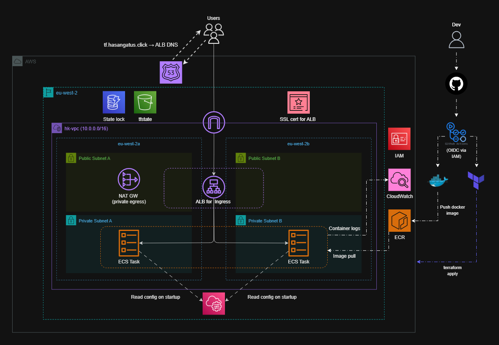
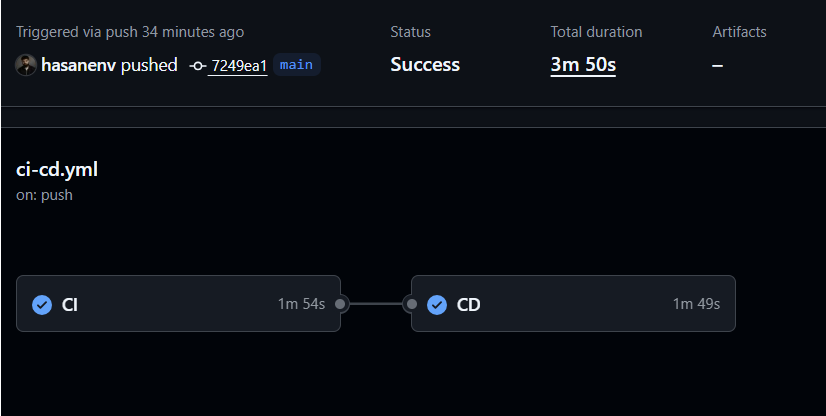
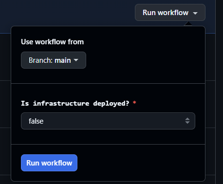

# Gatus Monitoring Platform on AWS (ECS Fargate, Terraform, CI/CD)


<p align="center">
  
</p>

---

## Table of Contents

- [Overview](#overview)
- [Design Priorities](#design-priorities)
- [Architecture Overview](#architecture-overview)
- [Repository Structure](#repository-structure)
- [CI/CD Workflow](#cicd-workflow)
- [Containers & Runtime](#containers--runtime)
- [IAM & Least Privilege Access](#iam--least-privilege-access)
- [Terraform & State Management](#terraform--state-management)
- [Observability](#observability)
- [Cost & Availability Decisions](#cost--availability-decisions)
- [What This Project Demonstrates](#what-this-project-demonstrates)

## Overview

A **secure container platform** built on AWS using **ECS Fargate**, **Terraform**, and **GitHub Actions**.

The platform focuses on **infrastructure design, security, and deployment automation**, with an emphasis on architectural clarity, safe delivery, and operational correctness.

## Design Priorities

- Infrastructure defined as code
- Secure CI/CD using OIDC, eliminating need for long-lived credentials
- Principle of least privilege applied consistently
- Immutable container deployments
- Explicit availability and cost tradeoffs

## Architecture Overview

The platform runs in a custom VPC spanning two Availability Zones and follows standard AWS reference architectures used in real deployments:

- Public subnets hosting an Application Load Balancer (multi-AZ) and a standard zonal NAT Gateway
- Private subnets running ECS Fargate tasks
- HTTPS and HTTP redirect enforced using ACM and Route 53
- Runtime configuration stored in **SSM Parameter Store**
- Centralised logging via CloudWatch
- Provisioned and managed through Terraform

### Gatus UI Running Behind ALB

<p align="center">
  
</p>

## Repository Structure

```
ecs-fargate-platform
|
├─ .github/
│  └─ workflows/
│     └─ ci-cd.yml
├─ app/
│  └─ gatus/
│     ├─ Dockerfile
│     ├─ entrypoint.sh
│     └─ .dockerignore
├─ assets/
│  ├─ ecs-diagram.png
│  ├─ gatus-demo.gif
│  ├─ cicd-summary.png
│  └─ manual-cd.png
├─ infra/
│  ├─ main.tf
│  ├─ provider.tf
│  ├─ variables.tf
│  ├─ outputs.tf
│  ├─ locals.tf
│  ├─ data.tf
│  ├─ ssm.tf
│  ├─ .terraform.lock.hcl
│  ├─ config/
│  │  └─ config.yaml
│  └─ modules/
│     ├─ acm/
│     ├─ alb/
│     ├─ ecr/
│     ├─ ecs/
│     ├─ iam/
│     ├─ route53/
│     ├─ security-groups/
│     └─ vpc/
├─ .gitignore
├─ LICENSE
└─ README.md
```

## CI/CD Workflow

> [!IMPORTANT]
> CI is treated as a hard gate. No infrastructure changes or deployments occur unless all validation steps pass.

CI runs on every push and pull request and performs validation only:

- Docker image build for verification  
- Terraform formatting, linting, and static checks
- Security scanning of the container image

CD runs only after CI succeeds:

- Manually triggered via GitHub Actions when infrastructure is available (added later)
- Authenticates to AWS using OIDC (no long lived credentials)  
- Builds and tags container images immutably  
- Applies Terraform and updates ECS task definitions

### CI/CD Successful Run
<p align="center">
  
</p>

### Manual Deployment Trigger
<p align="center">
  
</p>

## Containers & Runtime

- Multi-stage Docker build strips out tooling and reduces image size
- Reduced final image size by ~60% (from ~120 MB to ~75 MB)
- Explicit non-root user enforcing least privilege at runtime
- Reduced attack surface by removing unused binaries, package managers, and shells

## IAM & Least Privilege Access

> [!NOTE]
> IAM policies are intentionally scoped to the minimum permissions required for each role.

Access control is a foundational part of the platform design:

- Dedicated CI/CD role with scoped read and apply permissions  
- Separate ECS task execution role limited to runtime needs  
- All IAM configuration managed in Terraform to prevent drift

## Terraform & State Management

- Modular structure for clarity and reuse
- Remote Terraform state stored in S3
- State locking via DynamoDB

## Observability

- ECS task logs shipped to CloudWatch
- Log groups created and managed via Terraform
- No manual logging configuration or console setup required

---

## Cost & Availability Decisions

> [!NOTE]
> Cost optimisations are applied only where they do not affect customer facing availability.

Some design choices reflect deliberate tradeoffs:

- High availability on ingress paths (ALB, multi AZ)
- Single zonal NAT Gateway chosen to control cost on outbound traffic
- ECS Fargate avoids EC2 operational overhead

## Future Improvements

Several improvements could be made to extend the platform further:

- Refactor Terraform modules to make heavier use of `for_each` and maps to reduce repetition and improve scalability
- Split the CI/CD workflow into separate pipelines for clearer separation of concerns (for example):
  - Terraform plan (validation and review)
  - Terraform apply (controlled deployment)
  - Application build and image publishing
 
- Introduce path-based workflow triggers so pipelines run only when relevant parts of the repository change:
  - Infrastructure pipelines trigger only on changes under `infra/`
  - Application build and image push trigger only on changes under `app/`
 
- Add environment-based workflows (for example dev and prod) with promotion between stages
- Extend observability with CloudWatch alarms and metrics
- Revisit NAT Gateway design to evaluate regional vs single-AZ NAT Gateways (following recent AWS changes)

---

## What This Project Demonstrates

- AWS architecture designed with real operational constraints in mind
- Secure CI/CD using modern authentication patterns
- Infrastructure that is easy to reason about and audit
- Clear separation of concerns

This repository represents a realistic container platform, built under the same constraints and considerations found in production environments.
